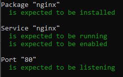

# Vagrant Lab Task

## Prerequisites

You will need the following software installed and working in order to follow along.

- [Ruby](https://www.ruby-lang.org/en/downloads/)
- [Vagrant](https://www.ruby-lang.org/en/downloads/)
- [VirtualBox](https://www.virtualbox.org/wiki/Downloads)
- [Visual Studio Code](https://code.visualstudio.com/download) or any other light-weight IDE.
- Download or Clone this repo and have it saved somewhere easily accessible.
- Bundler (`gem install bundler` if you have Ruby installed)

## First steps

Ensure that the applications are installed correctly. To do this simple open your command prompt / terminal / bash depending on your OS and type in the following command and check if the results are similar to the ones specified below.

Command:

```bash
ruby --version
```

Result:

```bash
ruby 2.7.2p137 (2020-10-01 revision 5445e04352) [x64-mingw32]
```

Command:

```bash
vagrant --version
```

Result:

```bash
Vagrant 2.2.13
```

## Virtual Box

Open your virtual box and ensure that its on in the background for the rest of the progress.


## Vagrant

### Testing

In order to make sure we have all the correct dependencies installed we need to run a test that will check if anything is missing.
</br>
To run our test we need to navigate to a subfolder containing a `Gemfile`. In our case its in the `environment/spec-tests/`. Here we run `bundle install` which will add our dependencies and create the `Gemfile.lock`. After this we can run `rake spec` that will test if our dependencies are installed on our machine. This test is expected to fail so do not fear an output that will be all red.

### Virtual Machine

Now that our tests have been ran. We can initialise our machine. Return back to our root folder (`cd ..` twice). From here run `vagrant up`. This will initalise our machine and run the necessary code to add some of the dependancies that failed earlier. After this process is complete we need to return back to our `environment/spec-tests/` and run our tests again. We will see that now, `nginx` is running correctly and passes the test.



### SSH

If we return once again to our root folder, we can now safely use `vagrant ssh` to connect to our machine. Once connected we can use it ready with `nginx` as we have predefined it to be automatically installed when we initalise our machine.
